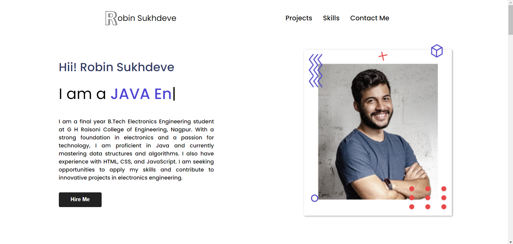
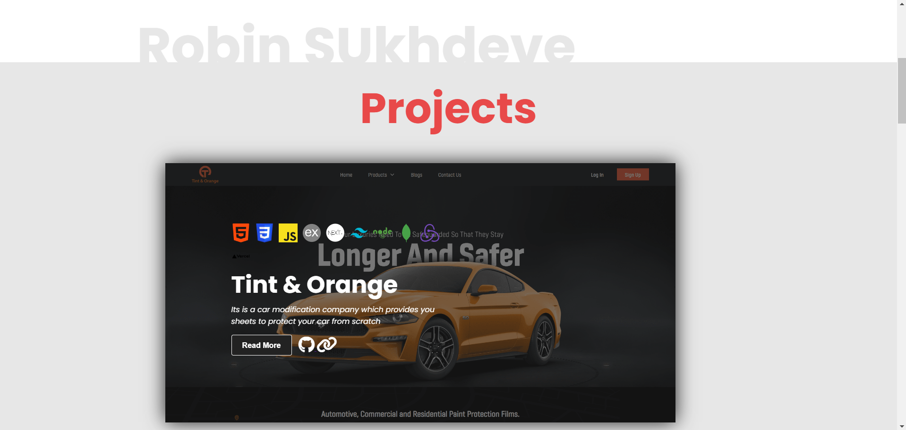
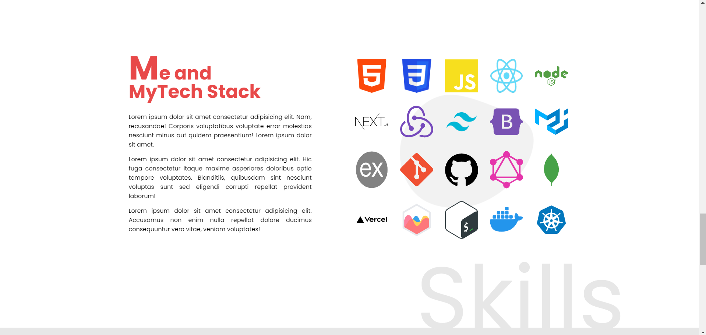
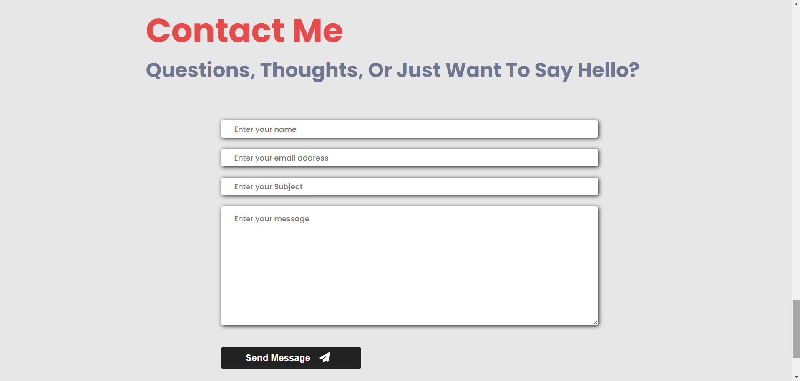
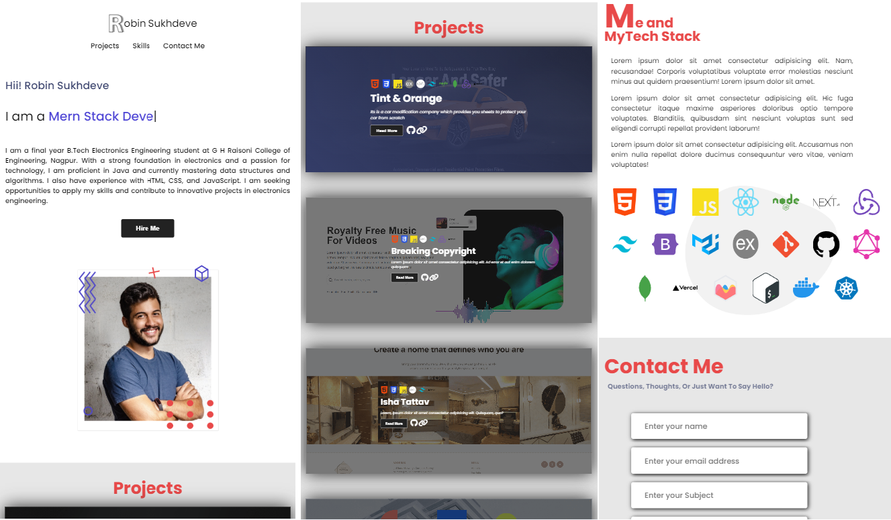

# Personal Portfolio Website

Welcome to my personal portfolio website repository. This project showcases my work, skills, and how you can contact me.

## Description

This is a responsive personal portfolio website built using HTML and CSS. The website is designed to be clean, user-friendly, and accessible on various devices. It features three main sections: Projects, Skills, and Contact Me.

## Live Demo

You can view the live website [here](https://robin-2407.github.io/personal-portfolio/).

## Sections

### Projects

In this section, you can find details about my projects, including descriptions, technologies used, and links to the live projects or their repositories.

### Skills

This section highlights my technical skills, including programming languages, frameworks, tools, and other relevant proficiencies.

### Contact Me

Feel free to reach out to me through this section. It includes a contact form where you can send me a message directly.

## Features

- **Responsive Design:** The website is fully responsive, making it accessible on desktops, tablets, and mobile devices.
- **Clean and Modern UI:** A minimalist design that focuses on readability and usability.
- **Interactive Elements:** Smooth transitions and hover effects for an engaging user experience.

## Screenshots

Here are some screenshots of the website:

Home Page


Project Section


Skills Section


Contact Section


Mobile View


## Getting Started

If you want to run this project locally, follow these steps:

1. Clone the repository:
    ```bash
    git clone https://github.com/Robin-2407/personal-portfolio.git
    ```
2. Navigate to the project directory:
    ```bash
    cd personal-portfolio
    ```
3. Open `index.html` in your browser.

## Technologies Used

- HTML5
- CSS3

## Contributing

Contributions are welcome! If you have any suggestions or improvements, feel free to open an issue or create a pull request.

## Contact

You can reach me at:
- Email: robinsukhdeve@gamil.com
- LinkedIn: [Robin Sukhdeve](https://www.linkedin.com/in/robin-sukhdeve-221569239/)
- Twitter: [@RobinSukhdeve](https://twitter.com/RobinSukhdeve)
